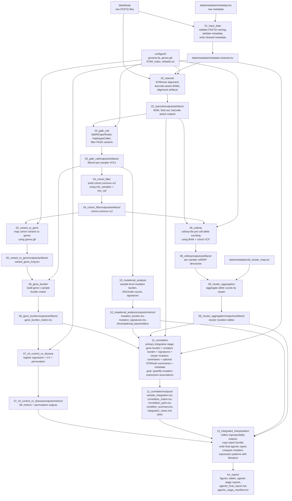
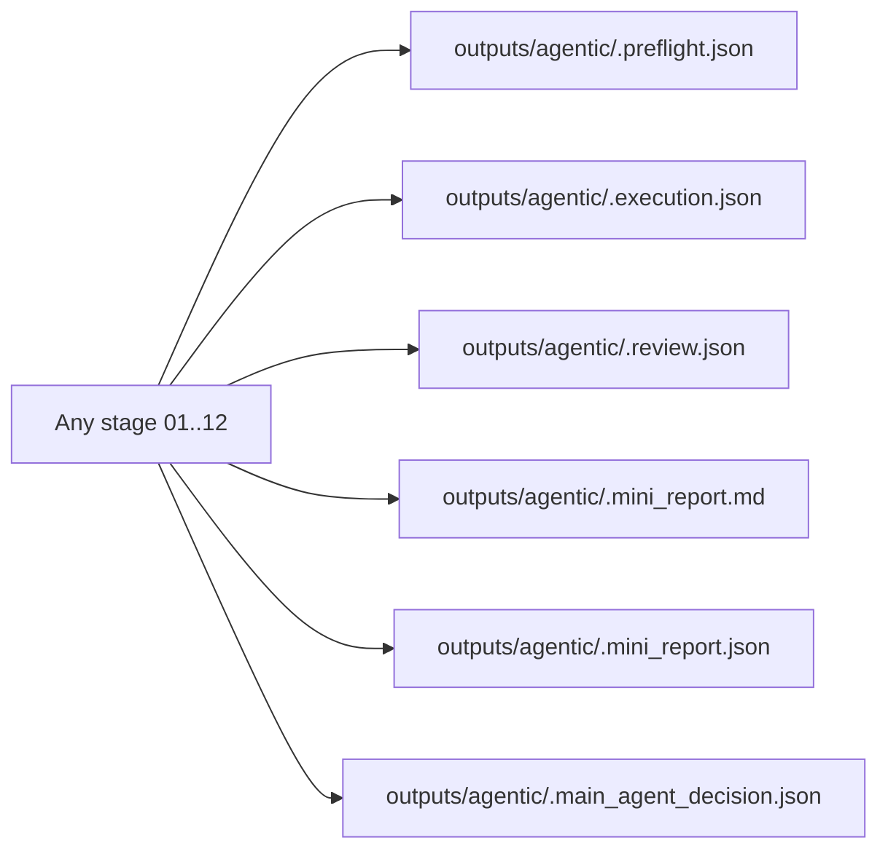

# Agentic Workflow Review

This document is the review version of the current repository workflow.
It is meant to be read inside VS Code / Cursor / Claude Code / Codex so you can point to the exact place that should change.

## 1. Canonical Agentic Control Loop

## 2. Detailed Legacy `01..12` Data Flow

## 3. Stage Registry

The stage pattern is always:

- `main_agent` assigns the stage
- `stage_preflight_agent` validates readiness
- `stage_execution_agent` runs the script
- `stage_review_agent` validates outputs
- `stage_report_agent` writes the mini report
- `main_agent` decides whether to advance

| Stage | Deterministic execution target | What review must confirm | Why the stage exists |
| --- | --- | --- | --- |
| `01_input_data` | validate FASTQ naming and metadata consistency | cleaned metadata exists and sample IDs are aligned | prevent contamination of every downstream step |
| `02_starsolo` | build alignment and barcode-aware STARsolo outputs | expected alignment artifacts exist for downstream mutation and single-cell analysis | create the expression-aware backbone |
| `03_gatk_call` | produce filtered expressed-variant calls per sample | filtered VCFs exist and are ready for cohort filtering and mutation summaries | convert aligned RNA reads into variant evidence |
| `04_cohort_filter` | derive the cohort-common variant set | cohort-common VCF exists and is non-empty | reduce sample-level calls to a shared mutation space |
| `05_variant_to_gene` | annotate cohort-common variants to genes | long-format variant-to-gene table exists | connect mutations to biological feature units |
| `06_gene_burden` | build the gene-by-sample burden matrix | matrix has gene rows and sample columns | create the feature space for statistics and modeling |
| `07_ml_control_vs_disease` | run classification and permutation testing | metrics and permutation outputs exist and are interpretable | test whether mutation-derived gene features separate groups |
| `08_cellsnp` | compute per-cell allele counts for cohort-common sites | per-sample cellsnp outputs exist | restore single-cell mutation evidence |
| `09_cluster_aggregation` | aggregate cellsnp outputs to clusters | cluster-level mutation summary tables exist | connect mutation burden to cellular structure |
| `10_mutational_analysis` | summarize sample-level mutation burden and signatures | burden and signature tables exist and are non-empty | characterize mutation load before integration |
| `11_correlation` | integrate mutation burden, signatures, cluster summaries, and expression-linked summaries | correlation outputs support mutation-expression association analysis | perform the main scientific integration step |
| `12_integrated_interpretation` | assemble report bundle and final narrative | final bundle is complete and ready for reproducibility review | compare observed mutation-expression relationships with published work |

## 4. Interpretation Priority

- `01..10` are enabling stages.
- `11_correlation` is the main inferential stage.
- `12_integrated_interpretation` must not just copy files. It must explain whether the observed mutation-linked signals are associated with expression-linked signals and how that compares with other studies.

The final workflow should answer:

1. Do mutation burden or mutation signatures track expression-linked sample differences?
2. Do cluster-level mutation summaries align with cluster marker programs or cell-type structure?
3. Are the observed associations strong, weak, or inconsistent?
4. Are they compatible with published studies on scRNA-seq variant analysis, wound biology, and mutation-associated transcriptional change?
5. Is the claim only correlation, or is there evidence strong enough to discuss candidate mutation-associated influence on expression?

## 5. Agentic Artifacts Written For Every Stage

## 6. Current Interpretation Of The Repo

- The repo is now modeled as one legacy `01..12` canonical pipeline with one controlling `main_agent`.
- The scientific computations still live inside deterministic scripts.
- Subordinate agents or skills handle stage-local validation, execution, review, and mini-report generation.
- The `main_agent` decides whether a stage is ready to run, whether the workflow may advance, and generates the final integrated output bundle.
- The main scientific endpoint is not Stage `07` ML in isolation. It is the mutation-expression integration produced in Stage `11` and interpreted in Stage `12`.
- The place where you are most likely to request structural changes is either:
  - stage order
  - stage dependencies
  - stage outputs
  - agent roles
  - what should count as PASS/FAIL per stage
  - what must be included in the final report bundle
