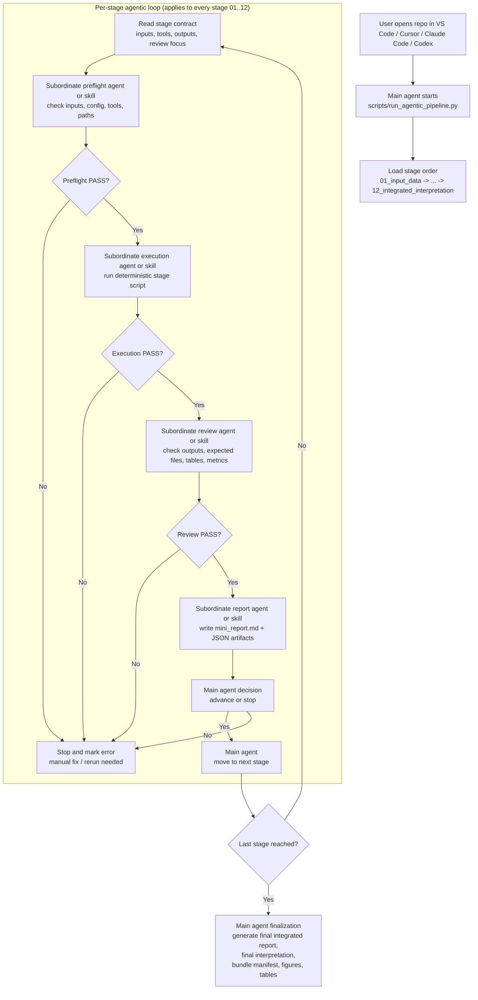
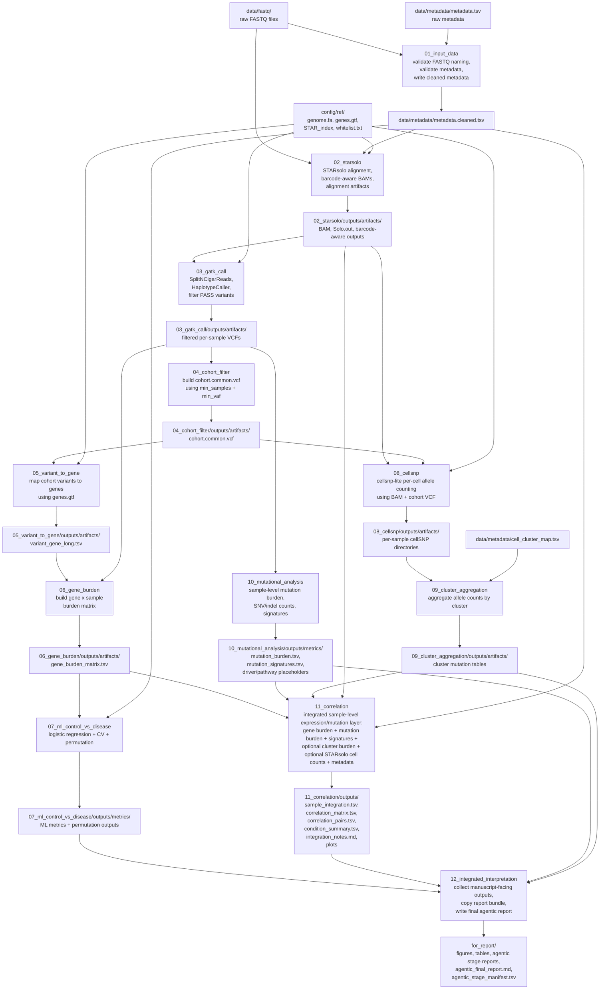
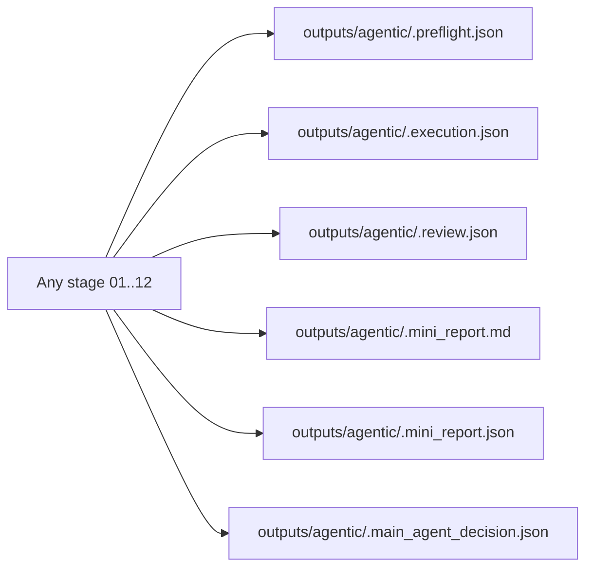

# Agentic Workflow Review

This document is the review version of the current repository workflow.
It is meant to be read inside VS Code / Cursor / Claude Code / Codex so you can point to the exact place that should change.

## 1. Canonical Agentic Control Loop

## 2. Detailed Legacy `01..12` Data Flow

## 3. What Each Stage Means

- `01_input_data`: checks whether the raw dataset is even runnable. If this stage is wrong, every downstream stage is contaminated.
- `02_starsolo`: creates the alignment backbone and barcode-aware outputs needed by both the mutation branch and the per-cell branch.
- `03_gatk_call`: converts aligned RNA-seq reads into filtered per-sample expressed variant calls.
- `04_cohort_filter`: reduces the sample-level variant space into a cohort-common mutation set.
- `05_variant_to_gene`: links the cohort-common variants to gene intervals.
- `06_gene_burden`: converts variant-to-gene links into a feature matrix for downstream statistics and ML.
- `07_ml_control_vs_disease`: tests whether the burden matrix can separate control vs disease.
- `08_cellsnp`: goes back to the single-cell level and counts reference/alternate alleles per cell for the cohort-common sites.
- `09_cluster_aggregation`: converts per-cell allele counts into per-cluster mutation burden summaries.
- `10_mutational_analysis`: produces sample-level mutation burden and simple substitution-signature summaries.
- `11_correlation`: is now the real integration stage, not just a single narrow correlation. It joins burden, mutation, signature, cluster, STARsolo-derived, and metadata-level summaries.
- `12_integrated_interpretation`: packages all manuscript-facing outputs and final agentic reporting artifacts.

## 4. Agentic Artifacts Written For Every Stage

## 5. Current Interpretation Of The Repo

- The repo is now modeled as one legacy `01..12` canonical pipeline with one controlling `main_agent`.
- The scientific computations still live inside deterministic scripts.
- Subordinate agents or skills handle stage-local validation, execution, review, and mini-report generation.
- The `main_agent` decides whether a stage is ready to run, whether the workflow may advance, and generates the final integrated output bundle.
- The place where you are most likely to request structural changes is either:
  - stage order
  - stage dependencies
  - stage outputs
  - agent roles
  - what should count as PASS/FAIL per stage
  - what must be included in the final report bundle
